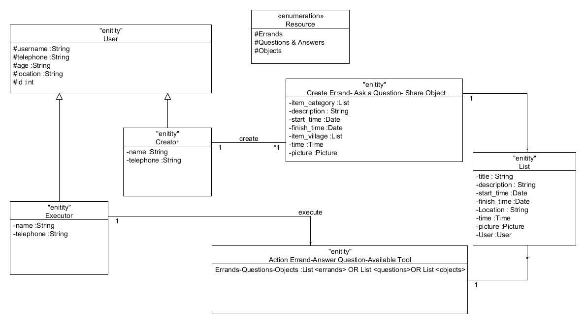

# testing

### *CommonTasker architecture*
CommonTasker is a mobile crowdsourcing application developed for the purposes of netcommons in the contect of Community Networks.The structure consists of the entities shown in the Figure. 
By using CommonTasker, users of the app are able to create different types of tasks and execute them. Tasks can be errands, questions or objects. 

The entity User can either be a creator of a task or an executor. Certain information are kept for each user such as their (nick)name, their telephone, their age(checks users for being over 18), the location (useful for executing spatially distributed tasks) and the ID used by the application for recognition of the particular user. 

Creators are users able to create a task i.e. create and post a new errand, create and post a question or create and post an object available for sharing. 

Tasks are grouped into different categories and are presented in the form of lists to the users of the app. Each list item (i.e. task) contains its title, a description, a start and finish time, the location, an accompanying picture and the user that has created the task.

Executors are users able to execute tasks that are created by creators. Executors select the task from the available list items and the different categories available and they accept to attend an errand, answer a question or select available objects shared by the creators.

### *Installing CommonTasker*

Please find the ,apk file and download it to your smartphone. It will be installed automatically. 

1. Verify whether the application has been installed successfully or not. 

2. Verify whether the application has been installed in a reasonable amount of time.

### *Launching CommonTasker*

1. Verify whether the application has been launched successfully or not. 

2. Verify whether the splash screen is installed a reasonable amount of time.

3. Verify that the application’s display is adapted to the screen size and all buttons and menus are easily clickable.

4. Check that each screen is appropriately displayed in each display mode (landscape, portrait). 

5. Verify that in the play screen, the back key allows to go back to the start-up screen or not. 

6. To validate whether all the required mandatory fields are working as required.

7. To validate that the closing of the application is performed from different states and verify if it re-opens in the same state.

8. Validation of the effective application recovery situation post unexpected interruption/crash scenarios.

9. Methods which deal with exiting the application. 

10. To ensure that the text is kept simple and clear to be visible to the users.

11. To ensure that the short sentences and paragraphs are readable to the end users.

12. To ensure that the application items are always synchronized according to the user actions. 

13. Verify whether the application faces any problem when the location is deactivated. 

